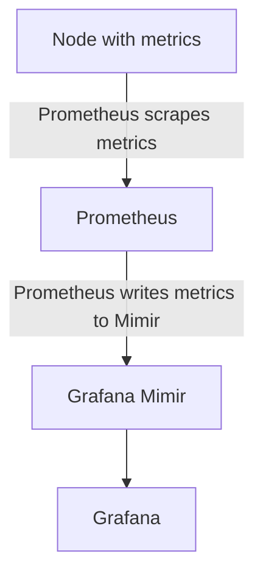

# Grafana Mimir

```mermaid
flowchart TD
    gfmimir["Grafana Mimir"]
    gf["Grafana"]
    prom["Prometheus"]
    node["Node with metrics"]

    node -->|Prometheus scrapes metrics|prom
    prom -->|Prometheus writes metrics to Mimir| gfmimir
    gfmimir --> gf

```
