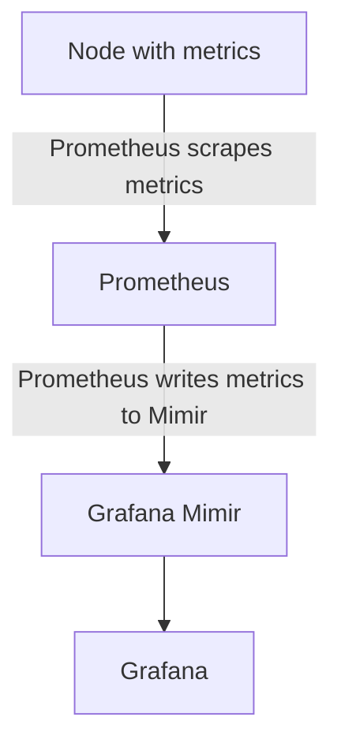

# Grafana Mimir

## Diagram 

## Thougths

Need a decent way of moving the target files from my central source of thruth
out to where the Prometheus instances are located as my network is rather poor.

### Fully automated

1. Parse the target source with a script
2. Separate the different instances based on a given criteria
3. Write the corresponding files
4. Have (CI/CD pipeline) or (cron and rsync shell script) move the correct file
   to the correct Prometheus instance at given times (every hour, every day, etc)
5. Profit

### Partially automated

1. Parse the target source with a script
2. Separate the different instances based on a given criteria
3. Write the corresponding files

When we want to update, trigger the pipeline or shell script manually

1. Have (CI/CD pipeline) or (rsync shell script) move the correct file to the
   correct Prometheus instance
2. Profit
